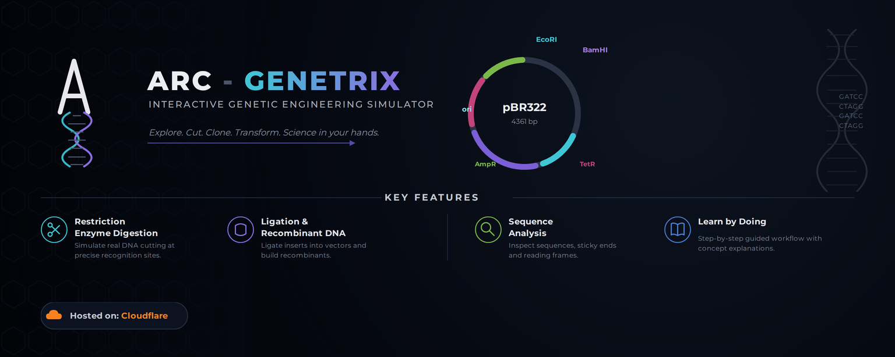

  
  

  # 🧬 Arc – Genetrix

  ### *Interactive Genetic Engineering Simulator*

  > An educational simulation exploring recombinant DNA technology through restriction enzyme cutting, sticky-end formation, and DNA ligation.

  **🧬 Genetic Engineering · 🧫 Recombinant DNA · 💊 Molecular Biology**

  ---

  ## ✦ Features

  **🧪 Restriction Enzyme Simulation**  
  Identify restriction sites and simulate DNA cleavage.

  **♎ Sticky-End Visualization**  
  Explore complementary overhang formation through staggered DNA cuts.

  **🧬 DNA Ligation**  
  Join compatible DNA fragments to simulate recombinant DNA formation.

  **🔬 Interactive Learning**  
  Understand genetic engineering workflows through step-by-step visualization.

  **🎴 Dark Interface**  
  A clean, focused environment designed for scientific exploration.

  ---

  ## ⚙️ Technology

  **HTML · CSS · JavaScript**

  **Interface:** Interactive Web Simulation  
  **Source:** GitHub  
  **Hosting:** GitHub Pages

  ---

  ## 📜 License

  **GNU General Public License v3.0 (GPL-3.0)**
